# ☸️ AETHER Enterprise Kubernetes Platform (Go Edition)

> **A modern, high-performance, enterprise-grade Kubernetes Management & Observability Platform built with Go (`k8s.io/client-go`), React 18, Vite, TailwindCSS, Monaco Editor, xterm.js, and SQLite.**

---

## 📸 Platform Overview

**AETHER Platform** unifies multi-cluster administration, developer tooling, real-time observability, and AI diagnostics into a single high-performance dashboard:

* **🚀 100% Pure Go API Backend**: Powered by `k8s.io/client-go`, `gorilla/websocket`, `golang-jwt`, and SQLite with zero external runtime dependencies.
* **🗄️ Unified SQLite Persistence (`server-go/data/aether.db`)**: Pure-Go SQLite engine (`modernc.org/sqlite`) with automatic 48-hour auto-retention cleanup for events and audit logs.
* **🔍 Interactive Cluster Event Inspector**: Clickable event cards with full severity badges, timestamps, involved resource specs, and raw OpenAPI 3.0 JSON payload viewer.
* **⚡ Live Container Streaming Logs**: Real-time line-by-line streaming of container stdout/stderr via WebSockets (`kubectl logs <pod> -f`).
* **💻 In-Pod Code Studio & GitOps Engine**: Browse container file systems, edit live code in Monaco Editor, hot-patch container runtimes, and commit changes back to Git & ArgoCD.
* **📈 6-Axis Prometheus & Pod-Level Telemetry**: Real-time CPU mCPU, Memory MiB, Network Rx/Tx, Disk IOPS, HTTP Requests/sec, and storage metrics with pod-level telemetry explorer.
* **🤖 AI Autonomous Diagnostic Copilot**: Automated root-cause analysis (RCA) for crashing/failing pods with 1-click automated YAML remediation patches.
* **📚 OpenAPI 3.0 & Interactive Swagger UI**: Self-documenting API spec exposed live at `/swagger` and `/docs`.

---

## 🏛️ System Architecture

```mermaid
graph TB
    subgraph "Frontend Layer (React 18 + Vite + Monaco + Xterm.js)"
        UI[Aether Platform Shell]
        NAV[Navigation & Cluster Switcher]
        IPCE[In-Pod Code Studio]
        EVT_MODAL[Cluster Event Inspector Modal]
        ARGO_UI[ArgoCD Applications Explorer]
        TOPO[Resource Topology DAG]
        TERM[Web Terminal & Kubectl Console]
        OBS_UI[Prometheus & Pod Telemetry Explorer]
        AI_UI[AI Diagnostic Drawer & 1-Click Fix]
        AUTH_UI[User RBAC & Audit Log Viewer]
    end

    subgraph "Backend Engine (Go 1.25 / Client-Go SDK / Gorilla WebSockets)"
        API_GW[Go REST & WebSocket API Gateway :4080]
        K8S_SVC[Native k8s.io/client-go SDK Service]
        POD_FS[In-Pod Container File System Engine]
        GIT_SVC[Local Git & ArgoCD Controller Client]
        AI_ENG[AI Diagnostic & RCA Engine]
        AUTH_ENG[User DB & JWT Auth Engine]
        AUDIT_SVC[Audit Logger with SQLite Persistence]
        METRICS_ENG[Prometheus & Pod Telemetry Aggregator]
        SWAG_SVC[OpenAPI 3.0 & Swagger UI Service]
    end

    subgraph "Storage & Infrastructure"
        SQLITE[(SQLite DB: server-go/data/aether.db <br/> 48h Retention Engine)]
        K8S_LIVE[(Live Kubernetes Cluster: MicroK8s, EKS, GKE, K3s)]
        LOCAL_GIT[(Local Git Repositories / Git Server)]
        ARGOCD[(ArgoCD GitOps Controller)]
    end

    UI --> API_GW
    IPCE --> POD_FS
    IPCE --> GIT_SVC
    EVT_MODAL --> API_GW
    ARGO_UI --> API_GW
    TERM --> API_GW
    OBS_UI --> METRICS_ENG
    AI_UI --> AI_ENG
    AUTH_UI --> AUTH_ENG

    API_GW --> SQLITE
    K8S_SVC --> K8S_LIVE
    GIT_SVC --> LOCAL_GIT
    API_GW --> SWAG_SVC
```

---

## 🛠️ Technology Stack

| Layer | Technologies Used |
| :--- | :--- |
| **Backend Engine** | Go 1.25, `k8s.io/client-go`, `gorilla/websocket`, `golang-jwt`, `golang.org/x/crypto` |
| **Database & Persistence** | Pure-Go SQLite (`modernc.org/sqlite`) with WAL mode & 48h auto-retention cleanup |
| **Frontend UI** | React 18, Vite 5, TailwindCSS, Lucide Icons, Recharts, Framer Motion |
| **Code & Diff Editor** | `@monaco-editor/react` (Monaco Editor & Split Diff Viewer) |
| **Terminal & Consoles** | `xterm`, `xterm-addon-fit` (Multi-tab WebSockets Terminal & Kubectl Shell) |
| **Documentation** | OpenAPI 3.0, Swagger UI (`swagger-ui-embed`), Markdown |

---

## ⚡ Getting Started

### Prerequisites
- **Go**: `1.22+` (Go 1.25 recommended)
- **Node.js**: `18+` & `npm`
- **Kubernetes**: MicroK8s, Minikube, K3s, or any valid `~/.kube/config`

### Quick Run (Dev Mode)

1. **Install Dependencies**:
   ```bash
   npm install
   ```

2. **Start Frontend & Go Backend Concurrently**:
   ```bash
   npm run dev
   ```

3. **Access Points**:
   - 🎨 **Web Dashboard**: `http://localhost:3080`
   - ⚡ **Go API Server**: `http://localhost:4080`
   - 📚 **Swagger API Docs**: `http://localhost:4080/swagger`

---

## 📖 Key API Endpoints

| Method | Endpoint | Description |
| :--- | :--- | :--- |
| `GET` | `/api/health` | Backend system health check & Go engine status |
| `POST` | `/api/auth/login` | Authenticate user & issue JWT bearer token |
| `GET` | `/api/k8s/resources?kind=Pod` | Fetch Kubernetes resources via `client-go` |
| `GET` | `/api/k8s/events` | Stream live cluster events (client-go + SQLite store) |
| `GET` | `/api/audit/logs` | Fetch operational audit log entries (48h retention) |
| `GET` | `/api/audit/metrics/pod/:name` | Fetch pod-level Prometheus CPU, memory, and I/O metrics |
| `POST` | `/api/ai/diagnose` | Run AI autonomous RCA diagnostic on failing workloads |
| `GET` | `/swagger` | Open interactive Swagger UI API documentation |

---

<details>
  <summary><b>Click to expand Screenshots</b></summary>

  <br>

  <p align="center">
    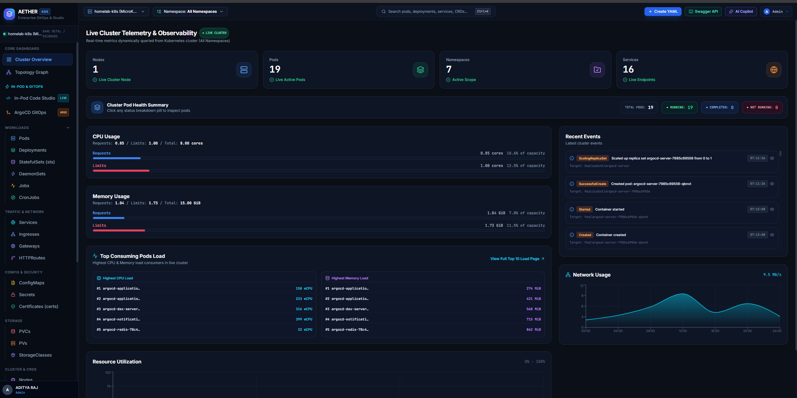
    <br><br>
    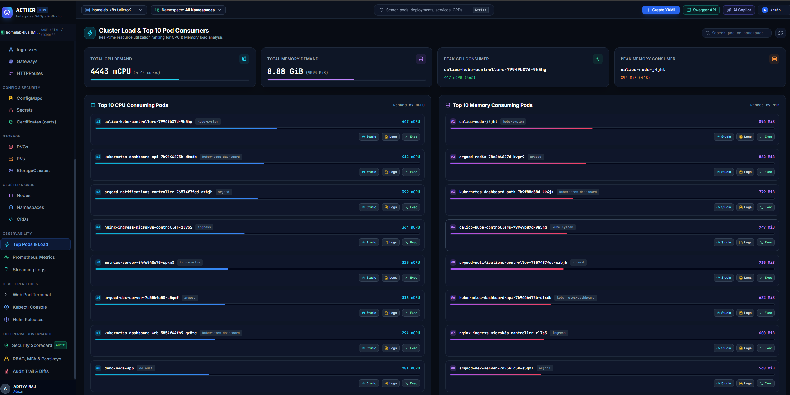
    <br><br>
    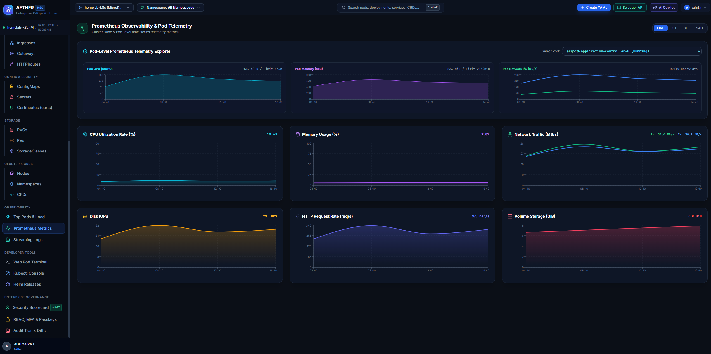
    <br><br>
    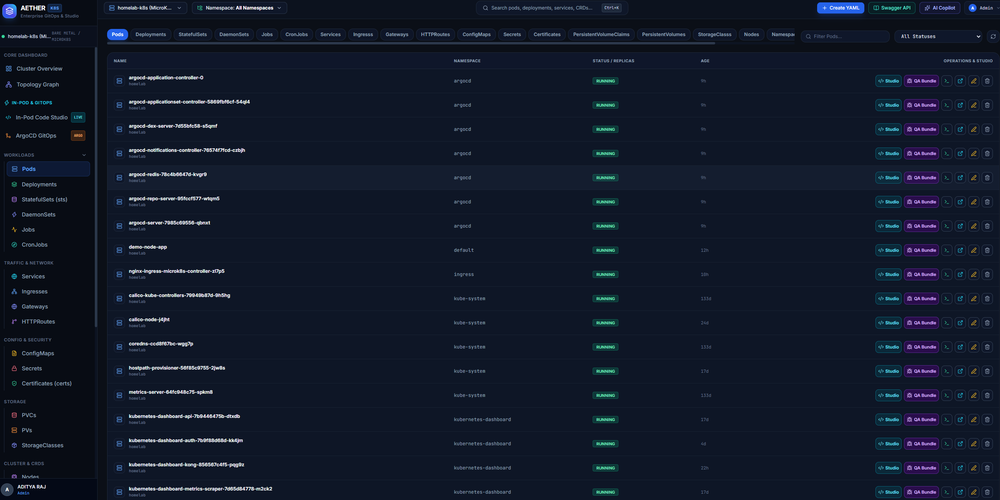
    <br><br>
    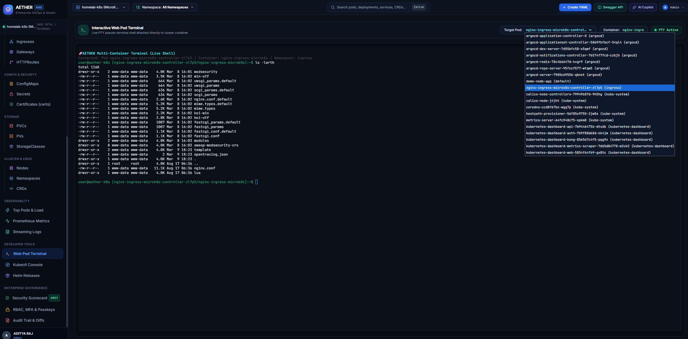
    <br><br>
    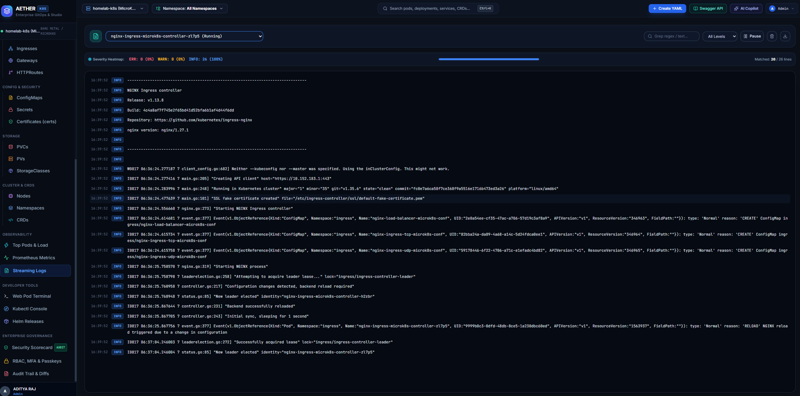
    <br><br>
    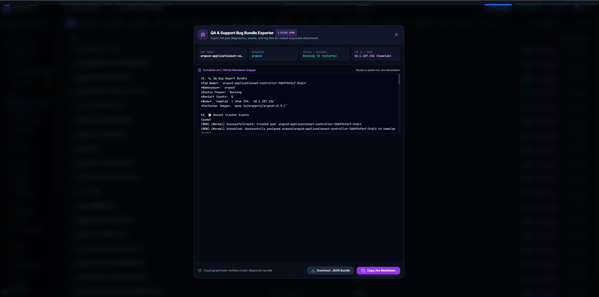
    <br><br>
    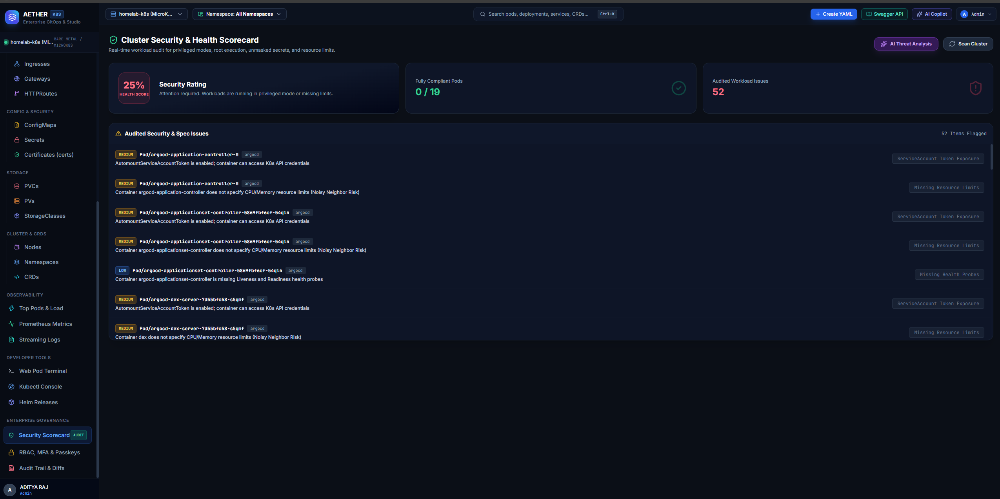
    <br><br>
    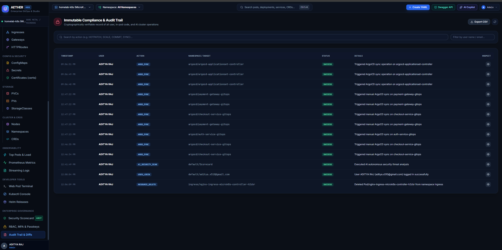
    <br><br>
    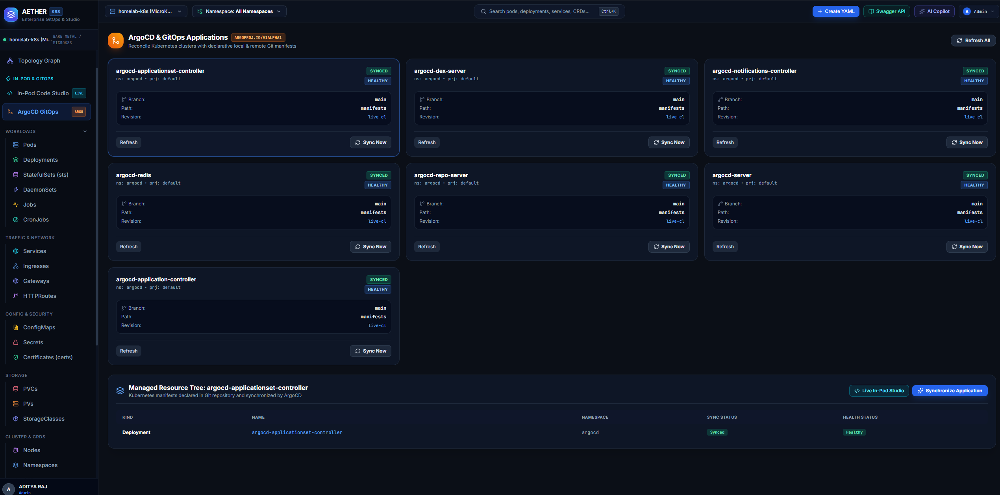
    <br><br>
    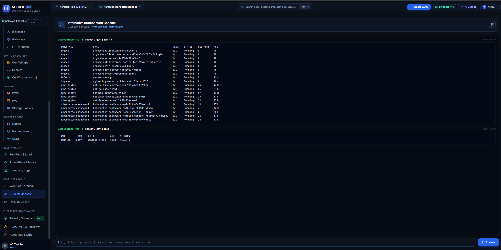
  </p>
</details>

---

## 📄 License & Credits

Built with ❤️ by **Aditya Raj** for the **AETHER Enterprise Kubernetes Platform**.
