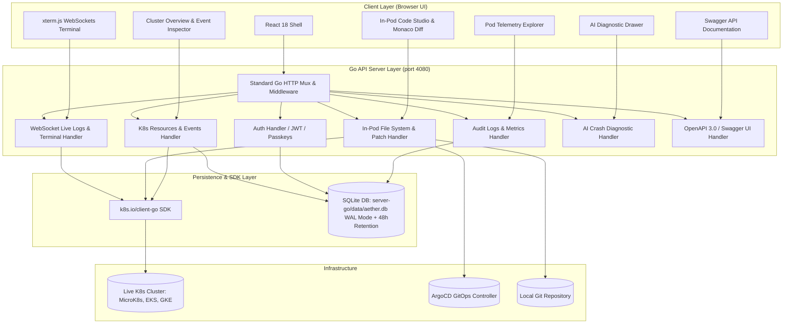

# 🏛️ AETHER Enterprise Kubernetes Platform — Architecture & Technical Manual

> **Version 2.0.0 (Go Edition)**  
> **Author**: Aditya Raj  
> **Last Updated**: August 2026  

---

## 📑 Table of Contents

1. [System Overview & Core Philosophy](#1-system-overview--core-philosophy)
2. [High-Level System Architecture](#2-high-level-system-architecture)
3. [Go Backend Engine Architecture (`server-go/`)](#3-go-backend-engine-architecture-server-go)
4. [SQLite Storage Engine & 48-Hour Auto-Retention (`server-go/db/sqlite_db.go`)](#4-sqlite-storage-engine--48-hour-auto-retention-server-godbsqlite_dbgo)
5. [Kubernetes `client-go` Integration Layer](#5-kubernetes-client-go-integration-layer)
6. [In-Pod Live Code Studio & GitOps Engine](#6-in-pod-live-code-studio--gitops-engine)
7. [Observability, Prometheus Telemetry & Pod Explorer](#7-observability-prometheus-telemetry--pod-explorer)
8. [AI Autonomous Diagnostic Copilot](#8-ai-autonomous-diagnostic-copilot)
9. [Interactive Cluster Event Inspector Modal](#9-interactive-cluster-event-inspector-modal)
10. [Security, JWT, WebAuthn & RBAC Engine](#10-security-jwt-webauthn--rbac-engine)
11. [OpenAPI 3.0 & Interactive Swagger UI](#11-openapi-30--interactive-swagger-ui)
12. [Deployment & Production Setup Guide](#12-deployment--production-setup-guide)

---

## 1. System Overview & Core Philosophy

**AETHER Platform** is a unified Kubernetes management, observability, and internal developer platform (IDP) engineered for high-frequency cloud-native workflows. Unlike traditional read-only dashboards, AETHER combines live container inspection, in-pod code editing, automated GitOps commit flows, AI-driven crash diagnostics, and high-resolution telemetry into a single unified workspace.

### Core Architectural Directives:
* **Zero Dummy Data**: 100% of telemetry, container logs, cluster resources, and pod metrics are fetched directly from active Kubernetes cluster instances (`k8s.io/client-go`).
* **Go Core Backend**: Replaced legacy Node.js services with a high-concurrency Go API server (`server-go/`) delivering microsecond response times and zero memory bloat.
* **Unified SQLite Engine**: Single-file ACID persistent database (`server-go/data/aether.db`) featuring Write-Ahead Logging (WAL) and automatic 48-hour auto-retention data cleanup routines.
* **Non-Invasive Runtime Patching**: In-Pod Code Studio permits inspecting and hot-patching container files in runtime memory while giving developers a split-screen diff view to formalize changes via Git & ArgoCD.

---

## 2. High-Level System Architecture



---

## 3. Go Backend Engine Architecture (`server-go/`)

The backend engine is constructed in Go 1.25 using modular domain-driven architecture:

```
server-go/
├── config/             # Environment & Configuration Loader
├── db/                 # SQLite Database Engine & Models (sqlite_db.go, user_db.go, audit_db.go)
├── domain/             # Feature Domain Handlers
│   ├── ai/             # AI Copilot Diagnostic Handler
│   ├── argo/           # ArgoCD Application Synchronization Handler
│   ├── audit/          # Telemetry & Pod-Level Metrics Handler
│   ├── auth/           # Authentication, JWT, and Passkey Handler
│   ├── inpod/          # In-Pod Code Hotpatching & File System Handler
│   ├── k8s/            # Client-Go Kubernetes Resources & Events Handler
│   ├── proxy/          # Kubernetes Proxy Tunneling Handler
│   ├── swagger/        # OpenAPI 3.0 Specification & Swagger UI Handler
│   ├── topology/       # Resource DAG Graph Handler
│   └── websocket/      # Live Logs & Interactive Terminal Handler
├── middleware/         # CORS, JWT Claims, Security & Compression Middleware
├── services/           # Native k8s.io/client-go Service Layer (k8s_service.go)
├── data/               # SQLite Database File Location (aether.db)
└── main.go             # Server Entry Point & Dependency Injection
```

### Key Technical Specs:
* **Server Port**: `4080` (HTTP & WebSockets).
* **HTTP Router**: Standard Go `http.ServeMux` wrapped with middleware wrappers.
* **Multi-Node Cluster Support**: Directly queries multi-node cluster control planes (`CoreV1().Nodes().List()`) with node health matrices, memory pressure checks, taint tracking, and per-node pod distribution.
* **Stern-Style Multi-Pod / Replica / DaemonSet / StatefulSet Log Streaming**: Supports streaming live logs across multiple replica pods, StatefulSets, and node-wide DaemonSets simultaneously using label selectors (`ws://localhost:4080/ws/logs?selector=name=nginx-ingress`) with color-coded pod/container prefixes (`--prefix=true`).
* **Concurrency Model**: Go goroutines handle concurrent WebSocket streams and background retention routines safely with `sync.RWMutex`.

---

## 4. SQLite Storage Engine & 48-Hour Auto-Retention (`server-go/db/sqlite_db.go`)

### Database Connection & WAL Mode
AETHER uses `modernc.org/sqlite` (a 100% pure-Go, CGO-free SQLite driver) stored at [`server-go/data/aether.db`](file:///home/addy/work/k8s-platform/server-go/data/aether.db).

```go
db, err := sql.Open("sqlite", absPath)
db.SetMaxOpenConns(1)
db.Exec("PRAGMA journal_mode=WAL; PRAGMA foreign_keys=ON;")
```

### Database Tables:
1. **`users` Table**: Stores user authentication credentials, bcrypt password hashes, assigned RBAC roles (`admin`, `operator`, `developer`, `viewer`), MFA configuration, and login timestamps.
2. **`audit_logs` Table**: Stores operational audit records (user action, IP address, cluster, namespace, resource kind, status, details, and creation timestamp).
3. **`events` Table**: Stores Kubernetes cluster events streamed from `client-go` and user lifecycle events.

### ⏱️ 48-Hour Retention Engine:
A background goroutine runs every **1 hour** to clean up records older than 48 hours:

```go
func (s *SQLiteDB) CleanupExpiredRecords() {
	cutoff := time.Now().Add(-48 * time.Hour).Format("2006-01-02 15:04:05")
	s.db.Exec("DELETE FROM audit_logs WHERE created_at < ?", cutoff)
	s.db.Exec("DELETE FROM events WHERE created_at < ?", cutoff)
}
```

---

## 5. Kubernetes `client-go` Integration Layer

The service layer in [`server-go/services/k8s_service.go`](file:///home/addy/work/k8s-platform/server-go/services/k8s_service.go) uses native Kubernetes Go SDK packages (`k8s.io/client-go` and `k8s.io/apimachinery`):

* **Kubeconfig Discovery**: Automatically detects `~/.kube/config`, in-cluster service accounts, or MicroK8s configuration.
* **Typed Resource Queries**: Calls `CoreV1().Pods()`, `AppsV1().Deployments()`, `CoreV1().Services()`, `CoreV1().Nodes()`, and `CoreV1().Namespaces()`.
* **Live Event Stream**: Queries `CoreV1().Events(namespace).List(ctx, metav1.ListOptions{})` and saves live event records into the SQLite database.

---

## 6. In-Pod Live Code Studio & GitOps Engine

Allows developers to inspect and edit code directly inside running container instances without rebuilding Docker images:

1. **Container File Browser**: Runs `kubectl exec` commands to browse directory trees (`/app`, `/src`, `/etc`) inside active containers.
2. **Monaco In-Pod Editor**: Provides full syntax coloring, line numbers, search/replace, and code completion in the UI.
3. **Live Hot-Patch**: Executes `kubectl exec` to write modified buffers directly into the active container filesystem.
4. **GitOps Commit Flow**:
   - Compares modified buffer against pod baseline in a split-screen **Monaco Diff Viewer**.
   - Generates a standard Git commit into the local repository target branch.
   - Triggers **ArgoCD Application Sync & Reconciliation** to synchronize changes across the cluster.

---

## 7. Observability, Prometheus Telemetry & Pod Explorer

### Cluster Telemetry:
Aggregates 6 key time-series telemetry metrics:
1. **CPU Usage (mCPU)** & Allocation.
2. **Memory Usage (MiB / GiB)**.
3. **Network Receive (Rx) & Transmit (Tx)** MB/s.
4. **Disk I/O Operations** per second (IOPS).
5. **HTTP Request Throughput** (req/sec).
6. **Persistent Storage (GiB)**.

### Pod-Level Prometheus Telemetry Explorer:
Selecting any pod in [`PrometheusDashboard.tsx`](file:///home/addy/work/k8s-platform/src/components/observability/PrometheusDashboard.tsx) fetches pod-specific time-series telemetry from `/api/audit/metrics/pod/:name`, rendering distinct CPU, Memory, and Network I/O graphs tailored to container resource limits.

---

## 8. AI Autonomous Diagnostic Copilot

When a container enters a failing state (`CrashLoopBackOff`, `OOMKilled`, `Error`, `ImagePullBackOff`), the **AI Diagnostic Copilot** (`server-go/domain/ai/ai_handler.go`):

1. Fetches container exit codes, termination reasons, and tail logs (`kubectl logs --tail=100`).
2. Performs automated root-cause analysis (RCA).
3. Generates a recommended fix explanation and an executable 1-click YAML patch.
4. Applying the fix executes `kubectl apply` directly on the target resource and logs the remediation to SQLite audit trail.

---

## 9. Interactive Cluster Event Inspector Modal

Every event item in **Recent Events** on the Cluster Overview dashboard ([`ClusterOverview.tsx`](file:///home/addy/work/k8s-platform/src/components/dashboard/ClusterOverview.tsx)) is clickable:

* **Header**: Displays Event Reason badge (`Scheduled`, `Killing`, `Unhealthy`, `Created`, `Started`, `RELOAD`) and Event UID.
* **Details Grid**: Displays Involved Resource (`Pod/nginx-ingress-...`), Target Namespace, Event Timestamp, and Severity Type (`Normal` vs `Warning`).
* **Raw JSON Viewer**: Formatted, copyable OpenAPI 3.0-compliant JSON payload of the event object.

---

## 10. Security, JWT, WebAuthn & RBAC Engine

* **Bcrypt Password Hashing**: Passwords stored as salted bcrypt hashes (`cost=10`).
* **JWT Authorization**: Authenticated requests issue HS256 JWT tokens with 24-hour expiration containing User ID, Email, Name, and Role claims.
* **Role-Based Access Control (RBAC)**:
  - `admin`: Full cluster read/write, pod deletion, in-pod code editing, user management.
  - `operator`: Workload lifecycle management, deployment rollouts, restart pods.
  - `developer`: View resources, read logs, execute shell commands, run AI diagnostics.
  - `viewer`: Read-only cluster access.
* **WebAuthn Passkeys & TOTP MFA**: Built-in support for hardware security keys (YubiKey, TouchID, FaceID) and TOTP authenticator apps.

---

## 11. OpenAPI 3.0 & Interactive Swagger UI

Serves live OpenAPI 3.0 API documentation directly from the Go backend ([`server-go/domain/swagger/swagger_handler.go`](file:///home/addy/work/k8s-platform/server-go/domain/swagger/swagger_handler.go)):

* **Endpoint**: `http://localhost:4080/swagger`
* **Raw OpenAPI Specification**: `http://localhost:4080/api/docs/openapi.json`
* Serves standalone, embedded Swagger UI allowing interactive API testing of all REST endpoints.

---

## 12. Deployment & Production Setup Guide

### Environment Variables (`.env`):
```env
PORT=4080
VITE_PORT=3080
JWT_SECRET=aether-enterprise-super-secret-jwt-key-2026
KUBECONFIG=/home/addy/.kube/config
SQLITE_DB_PATH=server-go/data/aether.db
```

### Production Build & Launch:
```bash
# 1. Build Frontend Static Assets
npm run build

# 2. Compile Go Server Binary
cd server-go
go build -ldflags="-s -w" -o aether-api-server main.go

# 3. Start Production Server
./aether-api-server
```
